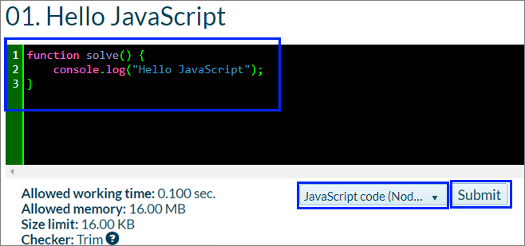

# Chapter 1. First Steps in Programming

In this chapter, we are going to find out **what programming** is at its core. We will get familiar with the idea of programming languages and explore the **environments for software development** (Integrated Development Environment – IDEs); we'll see how to work with them, in particular with **Visual Studio Code**. We will write and execute our **first program** written in the programming language **JavaScript** and then we'll exercise on a few tasks: we will create a console-based program and a Web application. We will learn how to use **SoftUni's Judge System** to check the correctness of our solutions to the problems in this book. Finally, we'll look at some typical mistakes made during code writing and we'll learn how to avoid them.

## What Does "To Program" Mean?

To program means to give instructions to the computer, for example, *play a certain sound*, *print something on the screen*, or *multiply two numbers*. When there's a series of commands, we have a computer program (script). The computer program's text is called **program code** (**source code** or just **code**).

## Computer Programs

**Computer programs** represent a **series of commands** written in a particular **programming language**, like Python, C#, Java, JavaScript, PHP, C, C++, Go, etc. To write commands, we need to be familiar with the **syntax and semantics of the language** we'll be using, in our case – **JavaScript**. In this book, we'll cover programming in general, as well as JavaScript's particular syntax and semantics. We'll examine each step of writing code, starting with the simplest and eventually reaching more complex programming constructs.

### Algorithms

Computer programs usually execute some sort of algorithm. **Algorithms** are a series of steps used to complete a task and achieve an expected result - something like a recipe. For example, if we need to fry some eggs, we follow a certain recipe (algorithm): we heat some oil in a pan, then we break the eggs, we wait until they're cooked, and finally, move the pan away from the heat. Similarly, in programming, **computer programs execute algorithms** – a series of commands needed to complete a certain task. If we want to print a series of numbers in ascending order, for example, we need an algorithm. It will go through all the numbers, find the smallest one and print it, then go through the rest of them and do the same until there are no more numbers left.
To make creating programs, writing program code (commands), executing it and other operations that have to do with programming more convenient, we need a **development environment** (IDE) like Visual Studio Code.

### Programming Languages, Compilers, Interpreters and Development Environments

**Programming languages** are artificial languages (syntax for expression), designed to **issue commands** which we expect the computer to read, process, and execute. With the help of programming languages, we write a series of commands (**programs**) that **tell the computer what to do**. Execution of computer programs can be achieved by using either a **compiler** or an **interpreter**.

**The compiler** translates code from a programming language into **machine code** and for each construct (command) in the code, it chooses an appropriate, predefined fragment of machine code while simultaneously checking the program's text for **errors**. Together, all the compiled fragments represent the original program translated in machine code, exactly how the computer's microprocessor is expecting it. After it's been compiled, the program can be directly executed by the microprocessor in cooperation with the operating system. Compiled programming languages **compile the program** before executing it and find syntactic errors (incorrect commands) during compile time. Languages like C++, C#, Java, Swift, and Go all work with compilers.

Some programming languages don't use a compiler but are **directly interpreted** by specialized software called an interpreter. **The interpreter** is a **program that executes programs**, written in some programming language. It executes the program's commands in sequence and understands not only single commands and series of commands but also other language constructs (checks, iterations, functions, etc.). PHP, Python, and **JavaScript** are languages that work with an interpreter and are executed without the need to be compiled. Due to lack of preliminary compilation, interpreted languages' errors are found during run time, after the program has already started working.

Overall, **compiled languages work more slowly than their interpreted counterparts**. The difference in execution speed is sometimes insignificant, but in other cases massive. In interpreted programming languages **we can change code more quickly and re-execute** (to remove a mistake, for example), while compiled languages are slower after a code change has been introduced, due to the need for compilation.

**The development environment** (Integrated Development Environment – **IDE**) combines traditional instruments for software development. In the development environment we write code, compile and execute programs. Development environments incorporate a text editor for writing code, a **programming language**, **a compiler or interpreter**, an **execution environment** where our program is executed, a **debugger** that traces our program and looks for errors, **instruments for design, and user interface** as well as other instruments and add-ons.

**Development environments** are convenient because they incorporate everything necessary to develop a program, so there's no need to leave the environment. If we don't use a development environment, we'll have to write code in a text editor, compile it with a command from the console, execute it with another command from the console and write additional commands, when needed, which will cost a lot of time. This is why most programmers use IDEs for everyday work.

Programming with **JavaScript** is usually done in the development environment **Visual Studio Code** which is developed and freely distributed by Microsoft. You can download it from: https://www.visualstudio.com/downloads/.
Alternatives to Visual Studio Code are **WebStorm** (https://www.jetbrains.com/webstorm/), **Atom** (https://atom.io/), and others. In this book, we'll be using the development environment **Visual Studio Code**.

### Low-Level, High-Level Languages and Runtime Environments

A program is, in essence, a **set of instructions** that ask the computer to carry out certain tasks. They are entered by the programmer and **executed unconditionally by the machine**.

There are different types of **programming languages**. **Lowest-level** languages can be used to write the very **instructions commanding the processor** - **Assembler** is one such language. Higher-level languages can be utilized to create an operating system, drivers for managing hardware (video card drivers, for example), web browsers, compilers, engines for game graphics (game engines), and other system components and programs. Even higher-level languages like **JavaScript**, **C#**, and **Python** are used to create application software, like programs for reading mail or chatting.

**Low-level languages** command hardware directly and require a lot of effort and a vast number of commands, to carry out a certain task. **Higher-level languages** require less code to achieve the same result but have no direct access to hardware. They are used to develop application software like web and mobile applications.

Most of the software we use daily like music players, video players, GPS programs, etc. is written on high-level **languages for application programming** like Python, JavaScript, C#, Java, C++, PHP, etc.

**JavaScript is an interpreted language** which means we write commands and they're executed immediately after running the program. As a result of that, we will realize we've made a mistake in our code only after we've started our program and reached the incorrect command. In cases like these, **IDEs** like Visual Studio Code are extremely helpful as they check our code while we're writing it and alarm us of potential issues. After we've written our code and want to test it, we can save it in a file with extension **.js**. 

Most **programming languages** are specialized in the development of certain types of applications – Desktop for Windows and Mac, mobile apps, server applications, applications that command smart gadgets, and many more. **JavaScript** is one of the few languages which allow you to create an application in every field you can think of – from websites and mobile apps to desktop applications.

The most popular JavaScript **interpreters** are the web browsers you use every day – Chrome, Firefox, Internet Explorer, etc. When loading your favorite website, it will likely contain **JavaScript** files which will execute upon opening the site and make your viewing experience of the site much more pleasant and dynamic. It's also very often the case that if the site has dropdown menus, animations, user registration, and annoying adverts, they are realized exactly by using the **JavaScript** language. 

You'll often hear that a certain piece of code is run on the **client-side**, which means that the **JavaScript** code is executed in your **browser**, which plays the role of client or receiver. But a receiver would have no purpose to exist without a transmitter. In the world of technology, these transmitters are called servers. You can imagine servers as extremely powerful computers, which many people have access to. Every site uses a similar server as its base – i.e. files that enable the site to look the way you see it – **pictures**, **texts**, **JavaScript files**, are located on a certain server. Your **browser** (client) connects to the **server** where the site you're visiting is located, and the server, in turn, **sends** back the necessary files for your favorite website to visualize in front of your eyes. Your browser is like a car radio where you listen to your favorite program, and the server is the building that transmits that program, although the communication follows a slightly different route in this case. 

The other popular **JavaScript interpreter** is **NodeJS**. You can imagine it's like an application you install on your computer which enables it to understand JavaScript the same way your browser does. That way you can execute **JavaScript** code directly on your computer, without the need for a browser. As we just mentioned, servers are just more powerful computers. They start understanding **JavaScript** in the same way your computer does – by having **NodeJS** installed. You can install **NodeJS** from their official website [https://nodejs.org](https://nodejs.org) completely free of charge, by simply following the instructions. 

## Computer Programs - Execution

As we already mentioned, a program is a **series of commands**, in other words, it describes a series of calculations, checks, iterations, and numerous other operations, which aim at producing a result.
The program is written in text format and the text is called **source code**. It's saved in a file with extension **.js** (**main.js**, for instance), and then it can be executed on your **browser** or the **console** with the help of **NodeJS**. In a moment we'll have a look at both options.

### Computer Programs – Problems

Let's start with a very basic example of a short **JavaScript program** that we'll run directly in your web browser (it supports JS without the need to install additional software).

#### Problem: a Program, Which Notifies the User
Our first program will consist of a single **JavaScript command**, which notifies the user they've won 1 000 000 dollars, as is often the case when you're browsing through a website with a lot of spam and adverts:
```JavaScript
alert("Congratulations!!! You have just won $1 000 000!");
```

We can run our program by using our browser's **JavaScript console**. In **Chrome**, for example, we can pull that up by pressing **[F12]** and we can then write our code in the **[Console]** window.


The result is something like this: a **modal popup message** in your browser: 


#### Problem: a Program, Which Spams the User with Notifications
We can increase the previous program's complexity by creating numerous command which repeat in sequence and notify the user they've won the lottery:
```JavaScript
for (i = 0; i < 10; i += 1) {
    alert("Congratulations!!! You have just won $1 000 000!");
}
```
In the example above we make the computer display notifications one after another until they become 10. The result is one very irritated user:

We will learn how iterations (loops) in programming work in the chapter "[Loops](chapter-05-loops.md)", but for now, let's assume that they just repeat a command many times.

#### Problem: Program, Which Converts BGN (Bulgarian Levs) into Euro

Let's have a look at another simple program that asks the user for an amount of money in levs (Bulgaria's currency)(whole number), makes sure that what's been entered is a number, converts it into euro (by dividing it by the euro exchange rate) and prints the result. This is a program of 3 consecutive commands. 
```JavaScript
let myMoney = prompt("How much money do you want to convert:");

let leva = parseInt(myMoney);
let euro = leva / 1.95583;
console.log(euro);
```
If we run this program in the browser's JavaScript console, we'll receive something like this:


We looked at **three examples of computer programs**: single command, series of commands in a loop, and a sequence of four commands. Let's now move on to the more exciting bit: writing our programs in **JavaScript** and executing them outside the browser.

## How do We Write a Console Program?

Let's go through the **steps for creating and executing a computer program** that uses a text console (window for entering and receiving text) to read and write its data. Such programs are known as **console-based**. Before we do that though, we need to **install and set up our development environment**, where we'll write and execute the **JavaScript** programs from this book and the exercises that go along with it.

## Development Environment (IDE)

As previously mentioned, we need a **development environment (IDE)** to program. The IDE is a program editor, where we can write, compile and execute our program code, discover our mistakes, correct them and start the program again.
-	For programming in JavaScript, we use the Visual Studio Code environment, suitable Windows, Linux, and macOS operating systems.
- If we are programming in **Java** we can use **IntelliJ**, **Eclipse**, or **NetBeans**.
- If we are programming in **Python** we can use **PyCharm**.

### Installing Visual Studio Code

In the following paragraphs, we go through the steps for installing **Visual Studio Code** (version 1.19.1) in great detail. After we download and start the installation file, the following screen should appear:


Press the **[Next]** button and then agree to the terms and conditions:


Visual Studio Code starts installing and once it's finished, we're almost ready to start writing code.
After you start VS Code, a window similar to the one below should appear:


Now is the time to make our **development environment** as pleasant as possible. **Visual Studio Code** is famous for being the IDE with the most options for personalization. Usually, this personalization comes in the form of **add-ons** (extensions). A list of all add-ons can be found on the official website: [https://marketplace.visualstudio.com/](https://marketplace.visualstudio.com/). Just keep in mind that most of these extensions are specific to a particular programming language. 

For a start, we recommend installing a couple of extensions that will drastically improve your JavaScript code writing:
* **Beautify** - [https://marketplace.visualstudio.com/items?itemName=HookyQR.beautify](https://marketplace.visualstudio.com/items?itemName=HookyQR.beautify) – this is an extension that helps you order your code and keep it looking clean.
* **JSHint** - [https://marketplace.visualstudio.com/items?itemName=dbaeumer.jshint](https://marketplace.visualstudio.com/items?itemName=dbaeumer.jshint) – as we mentioned, JavaScript is an interpreted language and core errors would appear only after running the program. This extension scans and alarms for potential issues while the code is written and before running the program.

They can be installed either via the given links or by going through the following steps in **Visual Studio Code**:
1.	In the leftmost panel, open the lowest tab – Extensions.
2.	In the search field enter the name of the extension you'd like to install.
3.	Choose the most appropriate option from the results.
4.	Then press the **[Install]** button.
5.	And restart **Visual Studio Code**.


That's it. We're ready to start working with **Visual Studio Code** and **JavaScript**.

 ### Online Development Environments

There are also **alternative environments to develop online**, directly in your web browser. They aren't very easy to use but if you have no other option, you can start your education with them and install **Visual Studio Code** later. Such a site for online JavaScript development is **JSBin** - [https://jsbin.com/?js,console](https://jsbin.com/?js,console).


Alternatively, we can do quick tests directly in our browser by pressing **F12** but in general, this is an option that works for very few lines of
code. Here's an example:


## Problem: Creating a Console Application 'Hello JavaScript'

Let's go back to our console program. We already have Visual Studio Code and we can start it. Then create a new **JavaScript file**: [**File**] &rarr; [**New File**]:


It's crucial to save our file from [**File**] &rarr; [**Save**], and don't forget the **.js** extension! We also need to give it a meaningful name like **helloJS**:


### Writing Program Code

Writing code in **JavaScript** requires no additional preparation – creating a file with the **.js** extension is all we need. So let's directly proceed with writing our first line of code. We'll write the following command:
```JavaScript
console.log("Hello JavaScript!");
```
Here's what our program should look like in **Visual Studio Code**:


The `console.log('Hello JavaScript!')` command means printing (`log(…)`) on the console (`console`) the message `Hello JavaScript!` which we need to surround with quotes, to signify it is text. At the end of every **JavaScript** command, we place a semicolon `;` which indicates the end of the command (meaning it doesn't continue on the next row). Although the latter is not compulsory, it's considered good practice which helps find problems more easily.

Important: the `alert(…)` and `prompt(…)` commands we used, work only in the web browser and are not available in VS Code console applications. If you try using them, you will receive an error. 

This command is very typical for programming: we signify we need a certain **object** (the console, in this case) to be found and a **certain action** ( printing something, passed within brackets, in this case) to be performed on it. In more technical terms, we call the method `log(…)` from the class `console` and pass as a parameter to it the text literal `Hello JavaScript!`.

### Starting The Program

To start the program we need to hit **[F5]**. The result will be displayed on the console, which, for our convenience, will open directly at the bottom of **Visual Studio Code**:


Notice we run the program with **[F5]**, not **[Ctrl + F5]**. If we use the latter, we won't be able to see the result because the program will execute very quickly and then disappear.

The output from the program is the following text message:
```JavaScript
Hello JavaScript!
```

The "**Debugging with inspector protocol . . .**" and **Debugger listening on...** messages are displayed as additional information at the very top of Visual Studio Code's console after the program starts executing. This gives us additional information about the execution which, for the time being, we will ignore. 

### Testing in The Judge System

Testing the solutions to the problems in this book is completely automated via the **Judge System's website**: [https://judge.softuni.org/](https://judge.softuni.org/). The solutions are judged in real-time by the system. Each solution goes through a series of tests that are hidden; every test that passes grants the user certain points.

The program we just wrote can be tested here: [https://judge.softuni.org/Contests/Practice/Index/926#0](https://judge.softuni.org/Contests/Practice/Index/926#0).

Each piece of **JavaScript** we'd like to test in the **Judge System** needs to be surrounded by the following lines of code:
````JavaScript
function solve() {
    // we place our code here
}
````

In other words, if we'd like to test the program we just wrote in the system, it will look like this:
````JavaScript
function solve() {
    console.log("Hello JavaScript");
}
````
We need to place the entire source code of the program in the black field and choose **JavaScript code**, as shown in the screenshot below:



Then we can send our solution by clicking the **[Submit]** button. The system returns a result in a few seconds which is displayed in the table of submitted solutions. If necessary, we can hit the **[Refresh]** button at the upper right-hand corner of the table of submitted solutions:


In that table, the Judge System will display one of the following **possible results**:
* A number of points (between 0 and 100), when the submitted code is compiled successfully (there are no syntactic errors) and can be tested.
  -	If our solution is **completely correct**, all tests are marked in green and we receive **100 points**.
  -	If our solution is **incorrect**, some tests are marked in red and we receive **less than 100** or **0 points**.
*	If there are syntactic errors in our program, we receive a **compile-time error message**.

## Executing Code in The Browser Using HTML + JS

So far we've seen how to make and execute a console program. Let's now look at how we can write code, which runs in our browser. All the websites you visit are created in a very similar fashion.

The principle is very similar to what we just did. The only difference is that when creating a new file, we use the **.html** extension instead of **.js**. All that's left is to enclose our code with a opening `<script>` and closing `</script>` **HTML** tag. We enclosed our code in much the same way when submitting our code in the Judge System. Here's what our code in **Visual Studio Code** should now look like:


With this approach, now we just need to find the **helloJS.html** file in the location we've saved it, and double click it. It will load in the browser but to see the result, we need to hit **F12**, which will open the browser's console. Our command prints on the console, so it makes sense that we need to bring it up to see the result. 


Now that you've **learned how to execute programs**, you can test the sample notification programs you have above. Have fun with them, try out different things. Try changing them and playing with them. Swap the `console.log("Hello JavaScript");`** command for `console.error("Error occurred");`** and start your program. Note that notification programs can only be executed in our browser and when we try running them from the console, we receive an error. This is because the console doesn't support notification via visual element, like `alert`.

## Typical Mistakes in JavaScript Programs

One of the usual mistakes beginners make is mixing up **capital and lowercase letters**. However, they matter when we call commands and can impede proper functioning. Here's an example of such a mistake:
```JavaScript
function solve() {
    Console.Log("Hello JavaScript");
}
```
In the example above, `Console` is written incorrectly and the capital letter needs to be changed to lowercase. Is there another similar mistake in the same example?

A missing **quotation mark** or **closing bracket** can also cause issues – the program will either **function improperly** or not execute at all. Such mistakes are hard to notice, especially with larger amounts of code. Here's an example:
```JavaScript
function solve() {
    console.log("Hello JavaScript);
}
```

This program will return an **error after it's started executing** and even before that, the code will be underlined by the extensions which monitor syntax, to draw the programmer's attention to the missed closing bracket.


## What Have We Learned from This Chapter?

First of all, we learned **what programming is – issuing commands written in a programming language** that the machine can understand and carry out. We also found out what a **computer program** is – a **series of commands** that aim to achieve a certain result. We gained some basic knowledge of the **JavaScript programming language** and learned how to create **simple console and web programs using Visual Studio Code**. Then we examined JavaScript's program code structure. We looked at printing on the console with the function `console.log()` and starting the program with **[F5]**. And last but not least, we now know how to test our code in **SoftUni's Judge System**.

Top work! Let's now tackle the **exercises**. You do remember that learning how to program involves a lot of code writing and problem-solving, right? Let's do just that and put what we've learned into practice.

## First Steps in Programming – Problems

Welcome to the exercises. We are now going to write a few console applications, which will help us make a few more steps into programming. Then we will show you how to program something more complex – programs with graphical and web user interfaces.

### Problem: Expression

Write a console-based **JavaScript** program that **calculates** and **prints** the value of the following numerical expression:

<p align="center"> (3522 + 52353) * 23 - (2336 * 501 + 23432 - 6743) * 3 </p>

Note: **you are not allowed to previously calculate the value** (for example with Windows Calculator).

### Hints and Guidelines

Create a new **JavaScript file** and name it `expression.js`. Then we need to write the **code** which will calculate the numeric expression above and print its value on the console. Pass the expression to the `console.log(...)` command by writing it within its brackets:


Start the program with **[F5]** and check whether the result matches the one from the picture:


### Testing in The Judge System

Test your solution here:
[https://judge.softuni.org/Contests/Practice/Index/926#1](https://judge.softuni.org/Contests/Practice/Index/926#1).

**Note**: Don't forget to enclose your code in the `solve()` function:
````JavaScript
function solve() {
    // your code
}
````


### Problem: Nums 1...20

Write a **JavaScript** console program that **prints the numbers from 1 to 20** on separate lines on the console.

### Hints and Guidelines
Create a new **JavaScript file** and name it `nums1to20.js`. Inside the file write 20 `console.log()` commands, each on a separate line, to print the numbers from 1 to 20 one after another. Some of you may be wondering if there is a cleverer way. Don't worry, there is, but we will mention it later on.


Let's now **start the program** and check whether the result is what we're expecting:
```
1
2
…
20
```
### Testing in The Judge System

Test your solution here:
[https://judge.softuni.org/Contests/Practice/Index/926#2](https://judge.softuni.org/Contests/Practice/Index/926#2).
Did you receive 100 points? If not, think of what you may be missing. Then try and think of a **cleverer** way to write this program, to avoid repeating the same command so many times. Look up information for "**[for loop JavaScript](https://www.google.com/search?q=for+loop+JavaScript)**" on the Internet.

### Problem: Triangle of 55 Stars

Write a **JavaScript** console program that **prints a triangle of 55 stars** on 10 lines:

```
*
**
***
****
*****
******
*******
********
*********
**********
```
### Hints and Guidelines

Create a new **JavaScript file** and name it `triangleOf55Stars.js`. Inside we need to write code that prints our triangle, for example by using 10 print commands, like in the example below:
```JavaScript
console.log("*");
console.log("**");
…
```

### Testing in The Judge System

Test your solution here:
[https://judge.softuni.org/Contests/Practice/Index/926#3](https://judge.softuni.org/Contests/Practice/Index/926#3).
Try and **improve your solution** to avoid repeating the same command so many times. Can this be achieved with a for-loop? Did you manage to invent a better solution (with a for-loop, for example) to the previous problem? The current problem can be solved with a similar, but a little more complex approach (a loop within another loop). It's completely fine if you can't figure it out, you'll remember this problem when we learn about loops in a few chapters.

### Problem: Rectangle Area

Write a **JavaScript program** that **receives two numbers a and b, then calculates and prints** the area of a rectangle with sides **a** and **b**.

### Sample Input and Output
| a | b | area |
| :---: | :---: | :---: |
| 2 | 7 |  14  |
| 7 | 8 |  56  |
| 12 | 5 |  60  |

### Hints and Guidelines
Create a new **JavaScript file**. For now, programs of similar type will be tested only in the **Judge System**, which has a built-in mechanism for passing input data to the program. To **receive the two numbers**, we need to declare our request by changing the enclosing code (the `solve()` function) we got used to writing:


Did you notice the change? We placed additional square brackets within the brackets of the function, inside which we described what data we're expecting to receive – in this case the numbers `a` and `b`, set as an array.
What's left is to finish the program so it can calculate the rectangle's area and print it. Pass the product of `a` and `b` to the familiar `console.log()` command. In programming, we multiply using the `*` operator.

### Testing in The Judge System

Test your solution here:
[https://judge.softuni.org/Contests/Practice/Index/926#4](https://judge.softuni.org/Contests/Practice/Index/926#4).

### \* Problem: Square of Stars

Write a **JavaScript** console program that **receives a whole positive number N** and **prints** a square of N stars on the console, like in the examples below.

### Sample Input and Output
| Input  |    Output   	| Input  |    Output   	| Input  |    Output   	| 
|-----|-----------|-----|-----------|-----|----------|
|  3  	|<code>\*\*\*</code><br><code>\*&nbsp;\*</code><br><code>\*\*\*</code>|  4  |<code>\*\*\*\*</code><br><code>\*&nbsp;&nbsp;\*</code><br><code>\*&nbsp;&nbsp;\*</code><br><code>\*\*\*\*</code>| 5  	|<code>\*\*\*\*\*</code><br><code>\*&nbsp;&nbsp;&nbsp;\*</code><br><code>\*&nbsp;&nbsp;&nbsp;\*</code><br><code>\*&nbsp;&nbsp;&nbsp;\*</code><br><code>\*\*\*\*\*</code>|

### Hints and Guidelines

Create a new **JavaScript console program**:


Finish the program so that it prints a square made up of stars. You may need to use `for`-loops. Search for additional information on the Internet.

**Caution**: this task is more difficult than the rest and is presented to you at this point purposefully. It's marked with a star, To provoke you to **look for information on the Internet**. This is one of the most important skills you have to develop while you're learning to program. This is what you'll be doing every day if you work as a developer, so don't be scared, try it out. If you're having difficulties, you can also ask for help in the SoftUni Reddit: https://www.reddit.com/r/softuni/.

### Testing in The Judge System
Test your solution here:
[https://judge.softuni.org/Contests/Practice/Index/926#5](https://judge.softuni.org/Contests/Practice/Index/926#5).

## Console, Graphical and Web Applications
With **console applications**, as you've already noticed, all operations for reading input and printing output are done on the console. The input data is entered on the **console** and then it is read by the application; the console is also used to print the output data after or during the runtime of the program.

While a console application **uses the text console**, web applications use a **web-based user interface**. To execute them, two things are needed – a web server and a web browser. The browser plays the main role in the visualization of data and interaction with the user. Web applications are much more pleasant for the user, they look better, and a mouse and touch screen can be used (for tablets and smartphones). Programming stands under all of that, of course. This is why we need to learn how to program and we have already made our first tiny steps toward achieving that.

Graphical (GUI) applications have a **visual user interface**, directly on your computer or mobile device, without a web browser. Graphical applications (also known as desktop applications) **contain one or more graphical windows** where certain **controllers** are located (text fields, buttons, pictures, tables, and others), which **allow dialog** with the user to be more intuitive. Similar to them are mobile applications on your smartphone or tablet: we use forms, text fields, buttons, and other controls, and we manage them with program code. This is why we learn to write code now: **code is everywhere in software development**.

## Exercises: Web Applications
We will now build a basic **web application** and after that, a simple graphical application, To have a look at what we will be able to create once we progress with programming and software development. We are not going to examine the techniques and constructions used in much detail. Rather, we are just going to have a peek at the arrangement and functionality of what we've created. After we progress with our knowledge, we will be able to develop bigger and more complex software applications and systems. We hope that the examples given below will **boost your interest**, rather than make you give up.

## Problem: Web Application Numbers Summator'
Write a **Web application** that **calculates the sum of two numbers**. 

After the numbers are entered in the first text fields, and the button **[Calculate]** is clicked, calculate their sum and display the result in the third text field. For our application, we'll use **HTML technology** which in combination with the **JavaScript programming language**, allows for the creation of **web applications and sites**, in the **Visual Studio Code** programming environment.

**HTML** is a descriptive language that is used to declare the content of a website. Without going into too much detail, we'll just mention that **HTML** is based on the use of combinations of **tags** to visualize and give **semanticity** to the content. In one of our previous examples, we already created an **HTML page** by utilizing the `<script>` tag.

Notice that we'll be creating a **web-based application**. This is an application accessible through a web browser, exactly like your favorite webmail or news site. The web application will have a server-side (Back-end), written in **JavaScript**, and a client-side (front-end), written in **HTML**. The Web application is expected to look similar to the following:


As opposed to console applications that read and write data in the form of text on the console, Web applications have a **Web-based user interface**. Web applications are **loaded from some Internet address** (URL) through a standard web browser. Users write input data on a page, visualized by the web browser, the data is processed on a web server and the results are shown again on a page in the web browser. As we mentioned we'll be using **HTML and JavaScript** for our web application. Other technologies which support creating **web applications** are **ASP.NET MVC technology**, **PHP technology**, etc. These technologies make creating the general application architecture – the server, as well as the client-side, much easier.

Let's move on to realizing our web application.

Create a **new HTML file** in VS Code and name it `sumator.html`.


Then write the following code:


This code **creates one web form containing three text fields and a button**. It's specified that pressing the **[Calculate]** button will call the `calculate` action.

Let's examine the code we just wrote.


On the first 2 rows, we declare that we're describing an **HTML page**, using the `<html>` and `<body>` tags, the latter declaring the start of our page's body – it's the main part that will be visualized. Respectively, the last 2 rows represent the corresponding **closing tags**, which declare the end of that particular part of our HTML page. Look more closely and you'll notice they're different from the **opening tags** – they have a forward slash '/' before the tag name - `</body>`, for example.

Using HTML tags in our page's body we'll describe what we want to be visualized on our webpage – three fields where numbers can be entered. This can be achieved with the `<input type ="number">` tag. Using this tag we declare that we want the input of type number to be visualized. The additional **attribute** – `id`, serves to let us determine a unique name for this **tag**. What we decide to call it is completely up to us. We'll need the `id` attribute later to get hold of information about this particular **HTML element**.

Then, on the 7th row we have another `input` tag declared, but this time it's of type `button`. This is how we indicate we want an element that, upon being clicked, produces some result. 

Let's now also look at the **JavaScript code** we wrote:


First, we **declare the `calculate()` function** which reads the information from our first two text fields (from our HTML page), then calculates their sum and **assigns** it as the third field's value. The function spans from the 9th to the 17th row. We'll learn what functions are, how they're declared and called, in this book's following chapters.

Looking more closely at the **function's body**, we observe that on the 10th row the **variable `firstNumber` is declared** and then the value of the text field with `id=firstNumber` is assigned to it. The `parseInt(…)` function makes sure that the text that's been entered will be converted to a number. Then similarly, we get the value of our second text field (with `id=secondNumber`). Finally, using the same mechanism, instead of obtaining the value of the third field with `id=result`, we **assign** a value to it by placing it on the left side of the equation.

Then on the 19th and 20th row we access our button and tell it to **listen** for `click` events which, when received, will trigger the function `calculate()` we just **declared**. In other words, when we use our mouse to click the button, the `calculate()` function will execute.
The application is ready. We can start it by finding its location and opening it. It will load inside the browser by default. 

Does this seem frightening? **There's no need to be scared!** We have a lot more to learn, to reach the level of knowledge and skills required to write web-based applications with ease like in the example above, as well as much bigger and more complex applications. If it all makes little sense, just keep going without worrying. In time, you will remember with a smile how incomprehensible and exciting your first collision with web programming was. If you're having issues with the example above, **watch the video** at the beginning of this chapter – the application is created step by step and explained in great detail. You can also ask for assistance in the **SoftUni Reddit: https://www.reddit.com/r/softuni/**.

The purpose of the example above (web application) is not to teach you, but to allow you to dive a little deeper into programming, **to fuel your interest** in software development, and to inspire you to study hard. **You have a lot more to learn**, but it is interesting, isn't it?
