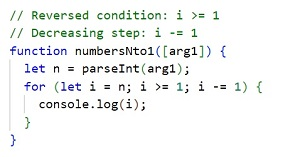
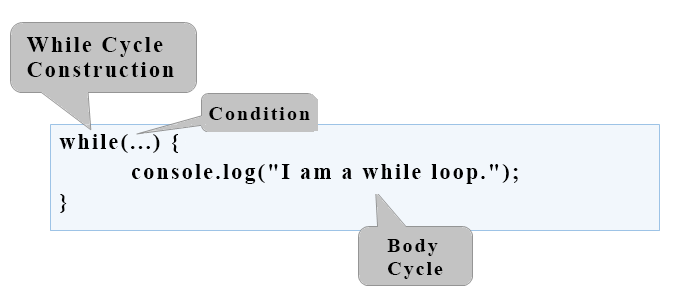

# Chapter 7.1. Complex Loops

Since we have learned what **`for`** loops are and their function in code, now is the time to take a look at **other loop types**, as well as some **more complex loop constructs**. These will expand our knowledge and help us solve more challenging problems. In particular, we will discuss how to use the following programming constructs:

- loops **with step**
- **`while`** loops
- **`do-while`** loops
- **infinite** loops

In the current chapter, we will also take a look at the **`break`** operator and **how** to empty it to **interrupt** a loop.

## Loops with a Step

In the **"Loops (Repetitions)"** chapter we learned how the **`for`** loop works and we already know when and to what purpose to use it. In the present chapter we will **take a look** at a particular and a very important **part of this structure** - its **step**.

### Loop with a Step – Explanation

The **step** is the **part** of the **`for`** loop, that specifies the **amount** used to **increment** or **decrement** the **main** variable. The **step** is declared in the skeleton of the **`for`** loop.

Most often we have a **size of `1`** and in this case, instead of writing **`i += 1`** or **`i -= 1`**, we can use the shorthand operators **`i++`** or **`i--`**. In case we need the step to be **different than 1** when increasing we use the shorthand **`i +=` + `required step`**, and when we decrease **`i -=` + `required step`**. With a step of 3 the loop would appear as below:


Here is a series of sample problems, the solution of which will help us better understand the use of a **step** in a **`for`** loop.

### Problem: Numbers 1...N with Step 3

Write a program that prints the numbers **from 1 to n** with a **step of 3**. For example, **if n = 100**, then the output would be: **1, 4, 7, 10, …, 94, 97, 100**.

We can solve the problem using the following sequence of actions (algorithm):

- We create a function that will take the number **`n`**.
- We run a **`for` loop from 1** to **`n`** with a step of **3**.
- in the **body of the loop**, we print the value of the current step.


#### Testing in The Judge System

You can test your solution at the following link: [https://judge.softuni.org/Contests/Practice/Index/937#0](https://judge.softuni.org/Contests/Practice/Index/937#0).

### Problem: Numbers N...1

Write a program that prints the numbers **from n to 1 in reverse** (step -1). For example, **if n = 100**, then the output will be: **100, 99, 98, …, 3, 2, 1**.

We can solve the problem in the following manner:

- We create a function that will take the number **`n`**.
- We run a **`for` loop**, by assigning **`let i = n`**.
- We reverse the condition of the loop: **`i >= 1`**.
- We define the step size: **-1**.
- in the **body of the loop**, we print the value of the current step.



#### Testing in The Judge System

You can test your solution at the following link: [https://judge.softuni.org/Contests/Practice/Index/937#1](https://judge.softuni.org/Contests/Practice/Index/937#1).

### Problem: Powers of Two

In the following example, we will use the standard size 1 step.

Write a program that prints the numbers **from 1 to 2^n** (two to the power of n). For example, **if n = 10**, then the output would be **1, 2, 4, 8, 16, 32, 64, 128, 256, 512, 1024**.


#### Testing in The Judge System

You can test your solution at the following link: [https://judge.softuni.org/Contests/Practice/Index/937#2](https://judge.softuni.org/Contests/Practice/Index/937#2).

### Problem: Even Powers of 2

Print the **even** powers of **2** until **2^n**: **2^0, 2^2, 2^4, 2^8, …, 2^n**. For example, if **n = 10**, then the output would be **1, 4, 16, 64, 256, 1024**.

Here is how we can solve the problem:

- We create a function that will take the number **`n`**.
- We declare a variable **`num`** that will hold the current number and we assign it the initial **value of 1**.
- For the **step** of the loop, we set a value of **2**.
- In the **body of the loop**: we print the value of the current number and **increase the current number `num` 4 times** (as per the problem description).


#### Testing in The Judge System

You can test your solution at the following link: [https://judge.softuni.org/Contests/Practice/Index/937#3](https://judge.softuni.org/Contests/Practice/Index/937#3).

## While Loop

The next type of loops that we will familiarize are called **`while` loops**. The special thing about them is that they repeat a command block **while a condition is met**. Their structure is a bit different than that of the **`for`** loops, however, they boast a simpler syntax.

### While Loop – Explanation

In programming, the **`while` loop** is used when we want to **repeat** the execution of a specific logic block until **a specific condition is met**. Any expression that returns either **`true`** or **`false`** (a Boolean) can be used as a "**condition**". When the **condition** becomes **invalid**, the **`while`** loop **is interrupted** and the program **proceeds** to execute the code after the loop. The **`while` loop** structure looks like this:



Here is a series of sample problems, the solutions of which will help us better understand the use of the **`while`** loop.

### Problem: Sequence 2k+1

Write a program that prints **all numbers ≤ n** in the series: **1, 3, 7, 15, 31, …**, assuming that each number is generated according to the following formula nextNumber = **previousNumber \* 2 + 1**.

Here is how we can solve the problem:

- We create a function that will take the number **`n`**.
- We declare a variable **`num`** that will hold the current number and we assign it the initial **value of 1**.
- For loop condition, we use **the current number <= n**.
- in the **body of the loop**: we print the value of the current number and increase the current number by using the formula above.

Here is a sample implementation of this idea:


#### Testing in The Judge System

You can test your solution here: [https://judge.softuni.org/Contests/Practice/Index/937#4](https://judge.softuni.org/Contests/Practice/Index/937#1).

### Problem: Number in Range [1...100]

Enter an integer in the range [**1 … 100**]. If the entered number is **invalid**, enter **another**. In this case, an invalid number would be any number that is **outside** the given range.

To solve the problem, we can use the following algorithm:

- We declare variable **`i`**, to which we assign the initial value of **0**. Through which we save the position of each argument passed to our function.
- We declare a variable **`num`**, to which we assign the integer part of the first argument, passed to the function.
- For a loop condition, we put a **`true`** expression, if the number **is not** in the range specified in the problem description.
- On the **body of the loop**: we increment **`i`** so that at the next loop cycle we can take the next number passed to our function. We print the message "**Invalid number!**" on the console, afterwards we assign a new value to **`num`** (the next argument, passed to our function).
- Once we have validated the entered number, we print its value outside the body of the loop.

Here is a sample implementation of the algorithm using a **`while` loop**:


#### Testing in The Judge System

You can test your solution here: [https://judge.softuni.org/Contests/Practice/Index/937#5](https://judge.softuni.org/Contests/Practice/Index/937#5).

## Greatest Common Divisor (GCD)

Before proceeding to the next problem, we should become familiar with the definition of the greatest common divisor (GCD).

**Definition of GCD**: the greatest common divisor of two **natural** numbers **a** and **b** is the largest number that **divides both** **a** and **b** without reminder. For example:

|  a  |  b  | GCD |
| :-: | :-: | :-: |
| 24  | 16  |  8  |
| 67  | 18  |  1  |
| 12  | 24  | 12  |
| 15  |  9  |  3  |
| 10  | 10  | 10  |
| 100 | 88  |  4  |

## The Euclidean Algorithm

In the next problem we will use one of the first published algorithms for finding the GCD – **Euclid's algorithm**:

**Until** we have a remainder of 0:

- We divide the greater number by the smaller one.
- We take the remainder of the division.

Euclid's algorithm **pseudo-code**:

```JavaScript
while b ≠ 0
  var oldB = b;
  b = a % b;
  a = oldB;
print a;
```

### Problem: Greatest Common Divisor (GCD)

Enter the **integers** **a** and **b** and find **GCD(a, b)**.

We will solve the problem by implementing **Euclid's algorithm**:

- We declare variables **`a`** and **`b`**, to which we assign the **integer** values, passed to our function.
- For loop condition, we use a **`true`** expression, if the number **`b`** **is different** than **0**.
- In the **body of the loop** we follow the instructions from the pseudo-code:
  - We create a temporary variable to which we assign the **current** value of **`b`**.
  - We assign a new value to **`b`**, which is the remainder of the division of **`a`** and **`b`**.
  - On variable **`a`** we assign the **previous** value of the variable **`b`**.
- Once the loop is complete and we have found the GCD, we print it on the screen.


#### Testing in The Judge System

You can test your solution here: [https://judge.softuni.org/Contests/Practice/Index/937#6](https://judge.softuni.org/Contests/Practice/Index/937#6).

## Do-While Loop

The next type of loop we will study is the **`do-while`** loop. By structure it resembles the **`while`**, but with a significant difference. The **`do-while`** will execute its body **at least once**. Why is this? In the **`do-while`** loop structure, the **condition** is always checked **after** the body, which ensures that the **first loop iteration** will **execute** the code and the check for **the end of the loop** will be applied to each **subsequent** iteration of the **`do-while`**.


Now we should proceed with the usual set of practical problems, that will help us better understand the **`do-while`** loop.

### Problem: Factorial

For natural **n** number, calculate **n! = 1 \* 2 \* 3 \* … \* n**. For example, if **n = 5**, then the result would be: **5!** = 1 \* 2 \* 3 \* 4 \* 5 = **120**.

Here is how we can calculate factorial in more detail:

- We declare the variable **`n`**, to which we assign the integer value, passed to our function.
- We declare another variable - **`fact`**, with an initial value of 1. We will use it in the calculation and store the factorial value.
- For the loop condition we will use **`n > 1`**, because each time we perform the calculations in the body of the loop, we will decrease the value of **`n`** by 1.
- In the body of the loop:
  - We assign a new value to **`fact`**, which value is the product of multiplying the current **`fact`** with the current **`n`**.
  - We decrement **`n`** with **1**.
- Outside the body of the loop, we print the final factorial value.


#### Testing in The Judge System

Test your solution here: [https://judge.softuni.org/Contests/Practice/Index/937#7](https://judge.softuni.org/Contests/Practice/Index/937#7).

### Problem: Sum Digits

Sum up the digits of the integer **positive** number **n**. For example if **n = 5634**, then the output would be: 5 + 6 + 3 + 4 = **18**.

We can use the following idea to solve the problem:

- We declare the variable **`n`**, to which we assign a value equal to the number passed to our function.
- We create a second variable - **`sum`**, with an initial value of 0. We will use it for the calculation and storage of the result.
- As a loop condition, we will use **`n > 0`**, since, after each iteration of the loop, we will be removing the last digit from **`n`**.
- In the body of the loop:
  - We assign a new value to **`sum`**, which is the result of the sum of the current value of **`sum`** with the last digit of **`n`**.
  - We assign a new value to **`n`**, which is the result of removing the last digit of **`n`**.
- Outside the body of the loop, we print the final value of the sum.


<table><tr><td></td>
<td><code><strong>n % 10</strong></code>: <b>returns</b> the last digit of the number <code><strong>n</strong></code>.<br>
<code><strong>Math.floor(n / 10)</strong></code>: <b>deletes</b> the last digit of <code><strong>n</strong></code>.</td>
</tr></table>

#### Testing in The Judge System

Test your solution here: [https://judge.softuni.org/Contests/Practice/Index/937#8](https://judge.softuni.org/Contests/Practice/Index/937#8).

## Infinite Loops and The `break` Operator

So far, we were introduced to various types of loops, learning what structures they have and how they are applied. Now, we need to understand what an **infinite loop** is, when it occurs, and how we can break it using the **`break`** operator.

### Infinite Loop – Explanation

An infinite loop **runs infinitely** the execution of its body. With **`while`** and **`do-while`** loops the end check is a conditional expression that **always** returns **`true`**. Infinite **`for`** occurs when there is **no condition to end the loop**.

Here is an example of an **infinite `while`** loop:


And here is an **infinite `for`** loop:


### The `break` Operator

We already know that the infinite loop executes a certain code infinitely, but what if we want at some point under a given condition to interrupt and exit the loop? The **break** operator comes in handy in this situation.

<table><tr><td></td>
<td>The operator <b><code>break</code></b> stops a loop's execution at the point it is called and the execution continues from the first line after the end of the loop. This means that the current iteration of the loop will not be completed accordingly and the rest of the code in the body of the loop will not be executed.</td>
</tr></table>

### Problem: Check Prime

The next problem we are going to solve is to **check whether a given number is prime**, but before that, we should remember what are prime numbers.

**Definition**: An integer is considered **prime** if it is divisible only by itself and by 1. By definition, the prime numbers are positive and greater than 1. The smallest prime number is **2**.

We can assume that an integer **n** is a prime number if **n > 1** and **n** is not divisible by a number between **2** and **n-1**.

The first few prime numbers are: 2, 3, 5, 7, 11, 13, 17, 19, 23, 29, 31, 37, 41, 43, …

By contrast, **composite numbers** are integers, which can be obtained by multiplying several prime numbers.

Here are some examples of composite numbers:

- **10** = 2 \* 5
- **42** = 2 _ 3 _ 7
- **143** = 13 \* 11

**An algorithm to check** whether a given number is **prime**: we check if **n > 1** and if **n** is divisible by **2**, **3**, …, **n-1** without remainder.

- If it is divisible by any of the numbers, it is **composite**.
- If it is not divisible by any of the numbers, then it is **prime**.

<table><tr><td></td>
<td>We can optimize the algorithm by instead of checking until <code><strong>n-1</strong></code>, checking divisors only until <code><strong>√n</strong></code>. Think of the reasons why this is so.</td>
</tr></table>

### Problem: Enter Even Number

You are tasked to write a function that takes a single input **n** integer and checks if it is prime. This can be implemented by checking if **n** is divisible by any numbers in the range between 2 and √n.

The steps of the **"prime checking algorithm"** are given below in bigger detail:

- We declare the variable **`n`**, to which we assign the integer passed to our function.
- We create a **`prime`** boolean with, and an initial value of **`true`**. We assume that a number is prime until proven otherwise.
- We create a **`for`** loop, with the initial value set to 2, for a condition the **current value `<= √n`**. The step is set to 1.
- In the **body of the loop**, we check if **`n`**, divided by the **current value** has a remainder. If there is **no reminder** from the division, then we change **`prime`** to **`false`** and exit the loop through the **`break`** operator.
- Depending on the value of **`prime`** we print whether the input number is prime (**`true`**) or composite (**`false`**).

Here is a sample implementation of the prime checking algorithm, described above:


What remains is to add a **condition that checks if the input number is greater than 1**, because, by definition numbers such as 0, 1, -1, and -2 are not prime.

#### Testing in The Judge System

Test your solution here: [https://judge.softuni.org/Contests/Practice/Index/937#9](https://judge.softuni.org/Contests/Practice/Index/937#9).

### Problem: Break Sum

Write a function, which checks whether a given number **n** is even and if so - print it on the console. An even number can be divided by 2 without a remainder. If the number is invalid, we will print that the current number is not even and the user will need to input a new number.

Here is an idea for the solution:

- We declare the variable **`i`**, which shall hold the initial value of **0**. Through it, we will store the position of every number passed to our function.
- We declare a variable **`num`**, with an initial value of **0**.
- We create an infinite **`while`** loop with a condition set to **`true`**.
- In **the body of the loop**:
  - We take the integer value, passed to our function, and assign it to **`num`**.
  - If **the number is even**, we exit the loop by a **`break`**.
  - **Otherwise**, we print a message stating that **the number is not even**. We increment **`i`** so that we can take the next number from the input on the next iteration. The iterations continue until an even number is entered.
- We print the even number on the console.

Here is an example implementation of the idea:


#### Testing in The Judge System

Test your solution here: [https://judge.softuni.org/Contests/Practice/Index/937#10](https://judge.softuni.org/Contests/Practice/Index/937#10).

## Nested Loops and The `break` Operator

Now since we know what the **nested loops** are and how the **`break`** operator works, it is time to figure out how they work together. To get a better idea, we should write a **function** step by step, that should make all possible combinations of **number pairs**. The first number in the pair is increasing from 1 to 3, while the second one is decreasing from 3 to 1. Our solution must continue running until **`i + j`** **is not** equal to 2 (i.e. **`i = 1`** and **`j = 1`**).

The desired result is:


Here is a **wrong implementation**, that looks right at first glance:


If we leave our function that way, our result will be as follows:


Why is this so? As we can see, the result is **missing "1 1"**. When the function reaches the point when **`i = 1`** and **`j = 1`**, it enters the **`if`** check and executes the **`break`** operation. This way, it **exits the inner loop**, but then continues the execution of the **outer loop**. **`i`** increases, the function enters the inner loop and prints the result.

<table><tr><td></td>
<td>When we use the <b><code>break</code> operator</b> in a <b>nested loop</b>, it interrupts <b>only</b> the execution of the inner loop.</td>
</tr></table>

What is the **correct solution**? One way to solve the problem is by declaring a **`bool` variable**, to keep track if the loop iteration has to continue. If we have to exit (leave all nested loops), we set the variable to **`true`** and exit the inner loop with **`break`** and in the next check, we exit the outer loop. Here is an example implementation of this idea:


In this manner, when **`i + j = 2`**, the program will set the variable **`hasToEnd = true`** and will exit the inner loop. Upon the next iteration of the outer loop, via the **`if`** check, the function will not reach the inner loop and will interrupt its execution.

### Testing in The Judge System

Test your solution here: [https://judge.softuni.org/Contests/Practice/Index/937#11](https://judge.softuni.org/Contests/Practice/Index/937#11).

## Exercises with loops

In this chapter, we got familiar with a few new types of loops that can perform repetitions with more complex programming logic. Let's solve a few practical problems using these new constructs.

### Problem: Fibonacci

Fibonacci's numbers in mathematics form a sequence that looks like this: **1, 1, 2, 3, 5, 8, 13, 21, 34, …**.

**The formula** to derive the next member of Fibonacci's sequence is:

```JavaScript
F0 = 1
F1 = 1
Fn = Fn-1 + Fn-2
```

#### Sample Input and Output

| Input (n) | Output | Comment               |
| --------- | ------ | --------------------- |
| 10        | 89     | F(11) = F(9) + F(8)   |
| 5         | 8      | F(5) = F(4) + F(3)    |
| 20        | 10946  | F(20) = F(19) + F(18) |
| 0         | 1      |                       |
| 1         | 1      |                       |

Enter an **integer** number **n** and calculate the **n-th Fibonacci number**.

#### Hints and Guidelines

An idea to solve the problem:

- We declare a **variable `n`**, which will hold the integer value passed to our function.
- We create the variables **`f0`** and **`f1`**, to which we assign the value to **1** since this is the start of Fibonacci's sequence.
- We create a **`for`** loop with condition **current value `i < n - 1`**.
- In the **body of the loop:**
  - We create a **temporary** variable **`fNext`**, to which we assign the next number in the Fibonacci sequence.
  - To **`f0`** we assign the current value of **`f1`**.
  - To **`f1`** we assign the value of the temporary variable **`fNext`**.
- Out of the loop we print the n-th number of Fibonacci.

Example implementation:


#### Testing in The Judge System

Test your solution here: [https://judge.softuni.org/Contests/Practice/Index/937#12](https://judge.softuni.org/Contests/Practice/Index/937#12).

### Problem: Number Pyramid

Print the **numbers 1 … n in a pyramid** as per the below example. On the first row, we print one number, at the second we print two, at the third, we print three, and so on, until the numbers are over. On the last line, we print as many numbers as we get until we get to **n**.

#### Sample Input and Output

| Input | Output                 | Input | Output          | Input | Output                        |
| ----- | ---------------------- | ----- | --------------- | ----- | ----------------------------- |
| 7     | 1<br>2 3<br>4 5 6<br>7 | 5     | 1<br>2 3<br>4 5 | 10    | 1<br>2 3<br>4 5 6<br>7 8 9 10 |

#### Hints and Guidelines

We can solve the problem with **two nested loops** (by rows and columns) by printing in them and leaving when the last number is reached. Here is the idea, written in more detail:

- We declare a variable **`n`**, to which we assign the integer value passed to our function.
- We declare a variable **`num`** with an initial value of **1**. It will hold the count of printed numbers. At each iteration, we will **increment** it by **1** and will add it to the current row.
- We declare a variable **`result`**, which will hold the current row and to which we will add the value of the current cell.
- We create an **outer** **`for`** loop, which will be responsible for the **rows** in the table. The loop variable will be named **`row`** and we assign it an initial value of **1**. For condition, we set **`row < n`**. The step will also be **1**.
- In the body of the loop, we create an **inner** **`for`** loop, which will be responsible for the **columns** in the table. We name the variable **`col`** and assign it an initial value of **1**. For condition we set **`col < row`** (**`row`** = number of digits per line). The step will also be **1**.
- In the body of the nested loop:
  - We check whether **`col > 1`**, if true we add a space to the variable **`result`**. If we do not make this check and instead add the space every time, each resulting line will start with a space.
  - We **store** the number **`num`** in the current cell of the table and **increment it by 1**.
  - We check if **`num > n`**. If the **`num`** is greater than **`n`**, we **interrupt** the **inner loop**.
- We print the value of the variable **`result`** and after that, we set it to an empty value. This way we can proceed to the next line.
- Again, we check if **`num > n`**. If it is greater, we **interrupt** the execution of **our function** with a `break`.

Here is an example implementation:


#### Testing in The Judge System

Test your solution here: [https://judge.softuni.org/Contests/Practice/Index/937#13](https://judge.softuni.org/Contests/Practice/Index/937#13).

### Problem: Number Table

Print the numbers 1 … n in a table as per the examples below:

#### Sample Input and Output

| Input | Output                  | Input | Output                                   |
| ----- | ----------------------- | ----- | ---------------------------------------- |
| 3     | 1 2 3<br>2 3 2<br>3 2 1 | 4     | 1 2 3 4<br>2 3 4 3<br>3 4 3 2<br>4 3 2 1 |

#### Hints and Guidelines

We can solve the problem by using **two nested loops** and some simple calculations in them:

- We take the size of the table from the integer value of the variable **`n`**, which is passed to our function.
- We declare the variable **`result`**, which will hold the current row and to which we will add the value of the current cell.
- We create a **`for`** loop, that will be responsible for the rows of the table. We name the loop variable **`row`** and assign it an initial value of **0**. For condition, we set **`row < n`**. The size of the step is **1**.
- In **the body of the loop** we create a nested **`for`** loop, that will be responsible for the columns in the table. We name the loop variable **`col`** and assign it an initial value of **0**. For condition, we set **`col < n`**. The size of the step is set to **1**.
- In **the body of the nested loop**:
  - We create a variable **`num`**, to which we assign the result of **the current row + the current column + 1** (+1 is needed since we count from 0).
  - We check whether **`num > n`**. If **`num`** is **greater** than **`n`**, we assign **`num`** a new value equal to **two times **`n`** - the current value of **`num`**. We do this in order not to exceed **`n`\*\* in any of the cells of the table.
  - We add the number of the current cell to the variable **`result`**.
- We print the value of the **result**, after which we set it to a new empty value. This way we can proceed to the next line.


#### Testing in The Judge System

Test your solution here: [https://judge.softuni.org/Contests/Practice/Index/937#14](https://judge.softuni.org/Contests/Practice/Index/937#14).

## What Have We Learned from This Chapter?

We can use **`for`** loops with a **step**:

```JavaScript
for (let i = 1; i <= n; i+=3) {
   console.log(i);
}
```

The **`while`** / **`do-while`** loops are repeated while a **condition is true**:

```JavaScript
let num = 1;
while (num <= n) {
   console.log(num++);
}
```

If we have to **interrupt** the loop execution, we use the **`break`** operator:

```JavaScript
let n = 0;
while (true) {
   n = parseInt(arg1);
   if (n % 2 === 0) {
      break; // even number -> exit from the loop
   }
   console.log("The number is not even.");
}
console.log(`Even number entered: ${num}`);
```
